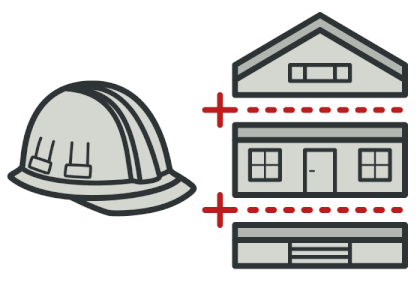

### Design Patterns Project
---
This repository provides an explanation of some design patterns and their implementations. Here you'll find infos about Design Pattern types (creational, structural and behavioral) and a comparison between their patterns and usage.

### :pushpin: Design Patterns

__1. Creational Patterns (Factory, Builder)__

These patterns are focused on object creation mechanisms, optimizing how objects are instantiated. 

| Pattern         | Purpose                                                   | Use Case                                                | Example in this Project                                      |
|-----------------|-----------------------------------------------------------|---------------------------------------------------------|---------------------------------------------------------|
| **Factory**     | provides an interface for creating objects without specifying the exact class of object to be created. | can use when the exact type of object to be created is determined by user input or runtime conditions. | creating different types of vehicles (cars, motorcycles, trucks) based on user input. |
| **Builder**     | constructs a complex object step by step, allowing different representations of the object to be created using the same construction process. | can use when constructing an object that requires multiple initialization steps or when the object needs to be represented in different ways. | constructing a house with different parts based on user choices. |

__2. Behavioral Patterns (Strategy, Mediator)__

These patterns are concerned with algorithms and the assignment of responsibilities between objects. Help objects communicate and interact in a clean and maintainable way.

| Pattern         | Purpose                                                   | Use Case                                                | Example in this Project                                      |
|-----------------|-----------------------------------------------------------|---------------------------------------------------------|---------------------------------------------------------|
| **Strategy**    | defines a family of algorithms, encapsulates each one, and makes them interchangeable. Allows the algorithm to vary independently from the clients that use it. | when there are multiple ways to perform a task, and the appropriate algorithm is selected at runtime based on user input or conditions. | selecting a transportation method (bus, cab, bicycle) to the airport based on budget and time constraints. |
| **Mediator**    | reduces the direct communication between objects by centralizing it through a mediator object, promoting loose coupling. | multiple objects need to communicate in a complex way, but coupling should be minimized by centralizing communication. | managing communication between aircraft and the air traffic control tower to ensure safe and organized communication. |

__3. Structural Patterns (Decorator, Facade)__

Structural patterns deal with object composition and typically identify simple ways to realize relationships between different objects. These patterns help ensure that if one part of a system changes, the entire system doesn’t need to be rebuilt.

| Pattern         | Purpose                                                   | Use Case                                                | Example in this Project                                      |
|-----------------|-----------------------------------------------------------|---------------------------------------------------------|---------------------------------------------------------|
| **Decorator**   | adds behavior to individual objects dynamically without affecting the behavior of other objects from the same class. | can use when need to add responsibilities to objects dynamically and transparently without affecting others. | add layers of clothing (sweater, jacket, raincoat) to a person, dynamically extending their functionality (e.g., warmth, protection). |
| **Facade**      | provides a simplified interface to a complex subsystem, making it easier to use by offering a high level interface. | When need to simplify interaction with a complex system by providing a single entry point. | simplifying interaction with different departments of a shop (ordering, payment, delivery) through a single operator interface. |

---
### :sparkles: Hands on!
This project contains a .NET Console App that uses the patterns mentioned above to solve simple everyday situations. Each pattern has a folder with its classes, interfaces and a diagram to demonstrate their layout. Here you'll find:

```
design-patterns-project
|
├── src
│   ├── Builder
|   ├── Decorator
|   ├── Facade
|   ├── Factory
|   ├── Mediator
│   └── Strategy
|
├── Program
└── README.md
```

### :file_folder: __Builder__
<div style="display: flex; align-items: center;">
    
    <p>Simulate the process of building a house. The user interacts with the console to choose different parts of the house, and the builder assembles these parts step by step.</p>
</div>

:runner: [Go to Classes Diagram](src/Builder/README.md)

### :file_folder: __Decorator__
<div style="display: flex; align-items: center;">
    <p>This pattern is implemented here by allowing the user to add layers of clothing to a person. The user can interact with the console to choose different garments, and each selected garment is added dynamically to the person, extending their "behavior" to demonstrates how the Decorator pattern can be used to enhance the functionality of objects at runtime.</p>
    
</div>

:runner: [Go to Classes Diagram](src/Decorator/README.md)

### :file_folder: __Facade__

<div style="display: flex; align-items: center;">
    
    <p>In this example, the Facade pattern is used to simplify the interaction with a shop's services. The user interacts with a single interface (the operator) to place orders, process payments, and arrange delivery.</p>
</div>

:runner: [Go to Classes Diagram](src/Facade/README.md)

### :file_folder: __Factory__
<div style="display: flex; align-items: center;">
    <p>Used to create different types of vehicles (cars, motorcycles, trucks) based on user input. The user selects the type of vehicle they want to create, and the Factory pattern handles the instantiation of the correct object.</p>
    
</div>

:runner: [Go to Classes Diagram](src/Factory/README.md)

### :file_folder: __Mediator__

<div style="display: flex; align-items: center;">
    
    <p>This pattern is demonstrated here through an air traffic control system. The user can select a type of aircraft (passenger or cargo), enter its flight or cargo number, and send a message to the control tower. The Mediator pattern ensures that communication between the aircraft and the control tower is managed centrally, preventing direct communication between the aircraft and simplifying the interaction.</p>
</div>

:runner: [Go to Classes Diagram](src/Mediator/README.md)

### :file_folder: __Strategy__

<div style="display: flex; align-items: center;">
    <p>Used to decide the best way to travel to the airport based on the user's budget and time constraints. The user inputs their preferences, and the Strategy pattern selects the appropriate transportation method (bus, cab, bicycle). This example highlights how the Strategy pattern allows the behavior of an object to be selected at runtime based on specific criteria.</p>
    
</div>

:runner: [Go to Classes Diagram](src/Strategy/README.md)

### :runner: Installing and Running

1.  Clone this repo `https://github.com/kmlyteixeira/design-patterns-project.git`
2.  Run `dotnet build` to install the dependencies 
3.  Run `dotnet run`
4.  The console should display the menu w/ the message: _Choose a Design Pattern to execute_


## :books: __Learn more__
:one: [Design Patterns: Elements of Reusable Object-Oriented Software](https://www.amazon.com.br/Design-Patterns-Elements-Reusable-Object-Oriented/dp/0201633612/ref=asc_df_0201633612/)

:two: [Identifique Quando e Como Usar o Design Pattern Strategy na Prática](https://www.youtube.com/watch?v=WPdrnuSHAQs)

:three: [Refactoring Guru](https://refactoring.guru/)

:four: [Design Patterns: Factories em PHP 8 - Por que fabricar objetos é muito poderoso?](https://www.youtube.com/watch?v=43qFyzFofgE)
