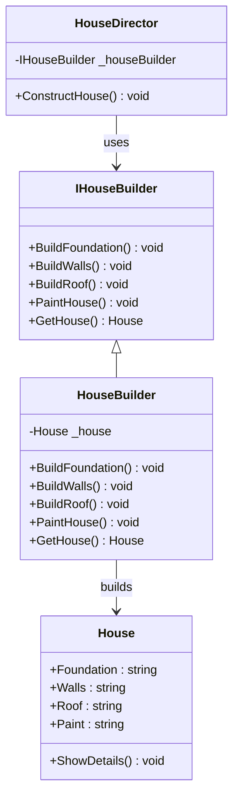

```mermaid
classDiagram
    class IHouseBuilder {
        +BuildFoundation() void
        +BuildWalls() void
        +BuildRoof() void
        +PaintHouse() void
        +GetHouse() House
    }

    class House {
        +Foundation : string
        +Walls : string
        +Roof : string
        +Paint : string
        +ShowDetails() void
    }

    class HouseBuilder {
        -House _house
        +BuildFoundation() void
        +BuildWalls() void
        +BuildRoof() void
        +PaintHouse() void
        +GetHouse() House
    }

    class HouseDirector {
        -IHouseBuilder _houseBuilder
        +ConstructHouse() void
    }

    IHouseBuilder <|-- HouseBuilder
    HouseBuilder --> House : builds
    HouseDirector --> IHouseBuilder : uses

```