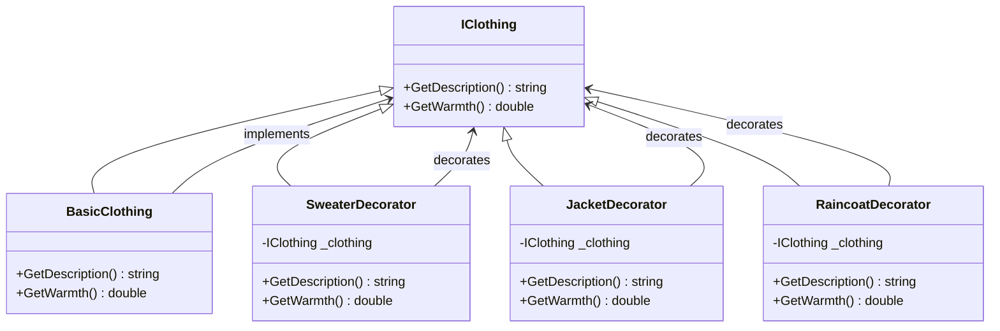

```mermaid
classDiagram
    class IClothing {
        +GetDescription() string
        +GetWarmth() double
    }

    class BasicClothing {
        +GetDescription() string
        +GetWarmth() double
    }

    class SweaterDecorator {
        -IClothing _clothing
        +GetDescription() string
        +GetWarmth() double
    }

    class JacketDecorator {
        -IClothing _clothing
        +GetDescription() string
        +GetWarmth() double
    }

    class RaincoatDecorator {
        -IClothing _clothing
        +GetDescription() string
        +GetWarmth() double
    }

    IClothing <|-- BasicClothing
    IClothing <|-- SweaterDecorator
    IClothing <|-- JacketDecorator
    IClothing <|-- RaincoatDecorator

    SweaterDecorator --> IClothing : decorates
    JacketDecorator --> IClothing : decorates
    RaincoatDecorator --> IClothing : decorates
    BasicClothing --> IClothing : implements

```