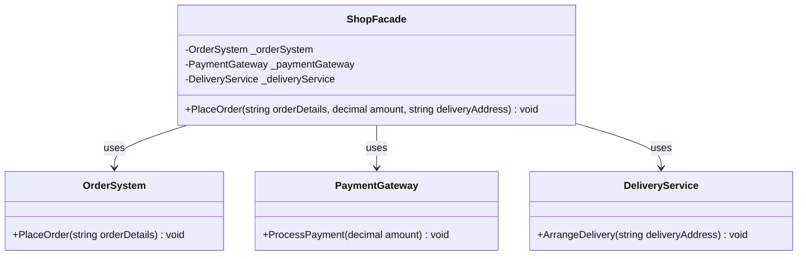

```mermaid
classDiagram
    class OrderSystem {
        +PlaceOrder(string orderDetails) void
    }

    class PaymentGateway {
        +ProcessPayment(decimal amount) void
    }

    class DeliveryService {
        +ArrangeDelivery(string deliveryAddress) void
    }

    class ShopFacade {
        -OrderSystem _orderSystem
        -PaymentGateway _paymentGateway
        -DeliveryService _deliveryService
        +PlaceOrder(string orderDetails, decimal amount, string deliveryAddress) void
    }

    ShopFacade --> OrderSystem : uses
    ShopFacade --> PaymentGateway : uses
    ShopFacade --> DeliveryService : uses
```