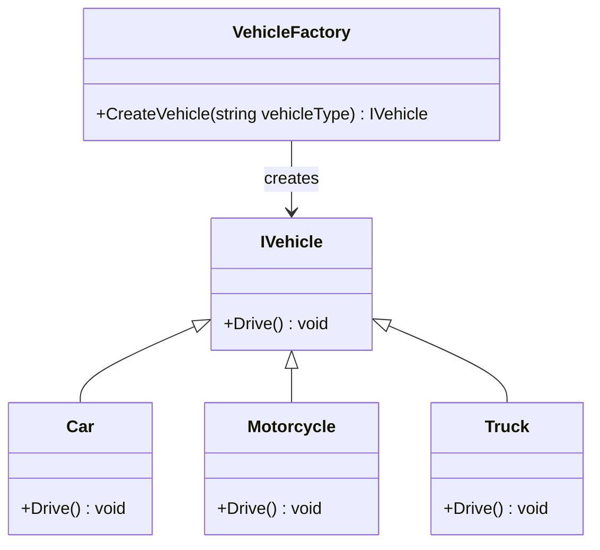

```mermaid
classDiagram
    class IVehicle {
        +Drive() void
    }

    class Car {
        +Drive() void
    }

    class Motorcycle {
        +Drive() void
    }

    class Truck {
        +Drive() void
    }

    class VehicleFactory {
        +CreateVehicle(string vehicleType) IVehicle
    }

    IVehicle <|-- Car
    IVehicle <|-- Motorcycle
    IVehicle <|-- Truck
    VehicleFactory --> IVehicle : creates
```