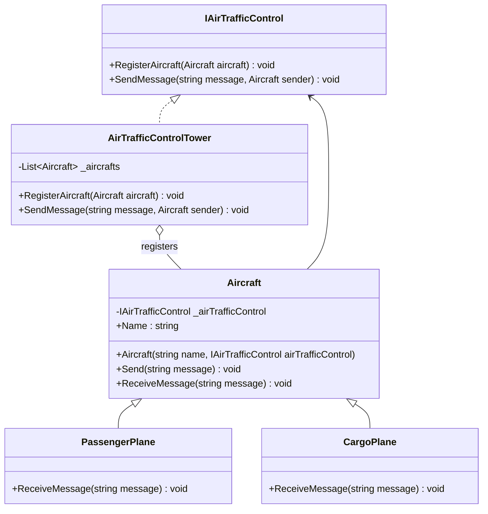

```mermaid
classDiagram
    class IAirTrafficControl {
        +RegisterAircraft(Aircraft aircraft) void
        +SendMessage(string message, Aircraft sender) void
    }

    class AirTrafficControlTower {
        +RegisterAircraft(Aircraft aircraft) void
        +SendMessage(string message, Aircraft sender) void
        -List~Aircraft~ _aircrafts
    }

    IAirTrafficControl <|.. AirTrafficControlTower

    class Aircraft {
        -IAirTrafficControl _airTrafficControl
        +Name : string
        +Aircraft(string name, IAirTrafficControl airTrafficControl)
        +Send(string message) void
        +ReceiveMessage(string message) void
    }

    class PassengerPlane {
        +ReceiveMessage(string message) void
    }

    class CargoPlane {
        +ReceiveMessage(string message) void
    }

    Aircraft <|-- PassengerPlane
    Aircraft <|-- CargoPlane
    Aircraft --> IAirTrafficControl
    AirTrafficControlTower o-- Aircraft : registers


```