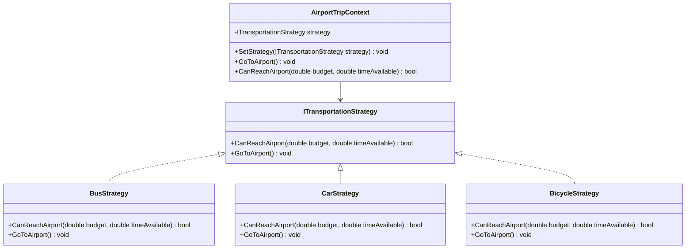

```mermaid
    classDiagram
        class ITransportationStrategy {
            +CanReachAirport(double budget, double timeAvailable) bool
            +GoToAirport() void
        }

        ITransportationStrategy <|.. BusStrategy
        ITransportationStrategy <|.. CarStrategy
        ITransportationStrategy <|.. BicycleStrategy

        class BusStrategy {
            +CanReachAirport(double budget, double timeAvailable) bool
            +GoToAirport() void
        }

        class CarStrategy {
            +CanReachAirport(double budget, double timeAvailable) bool
            +GoToAirport() void
        }

        class BicycleStrategy {
            +CanReachAirport(double budget, double timeAvailable) bool
            +GoToAirport() void
        }

        class AirportTripContext {
            -ITransportationStrategy strategy
            +SetStrategy(ITransportationStrategy strategy) void
            +GoToAirport() void
            +CanReachAirport(double budget, double timeAvailable) bool
        }

        AirportTripContext --> ITransportationStrategy
```